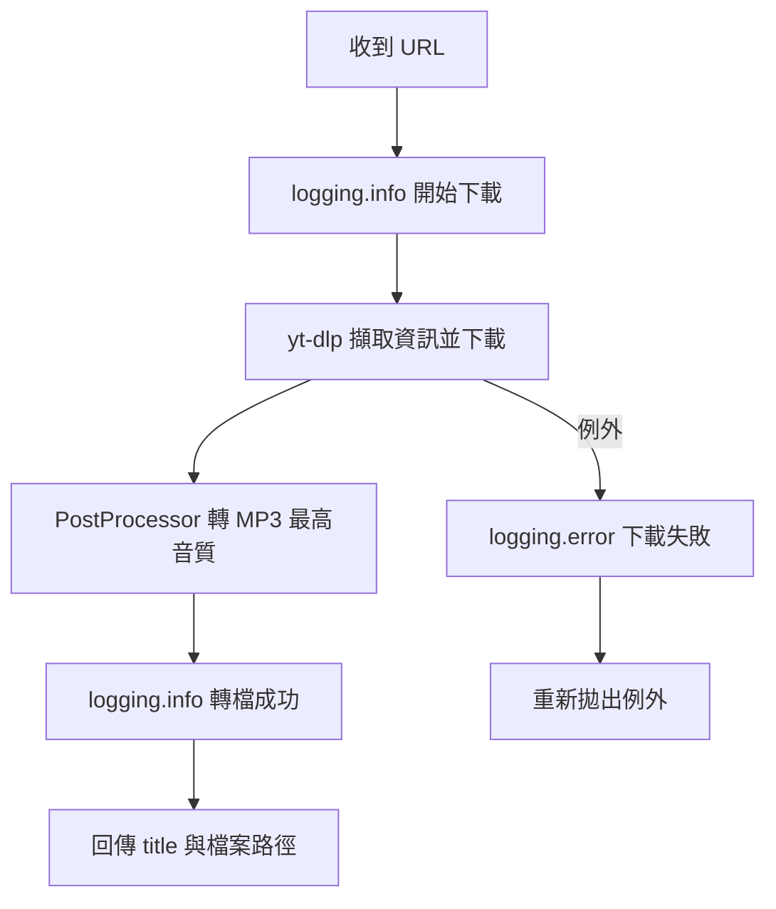
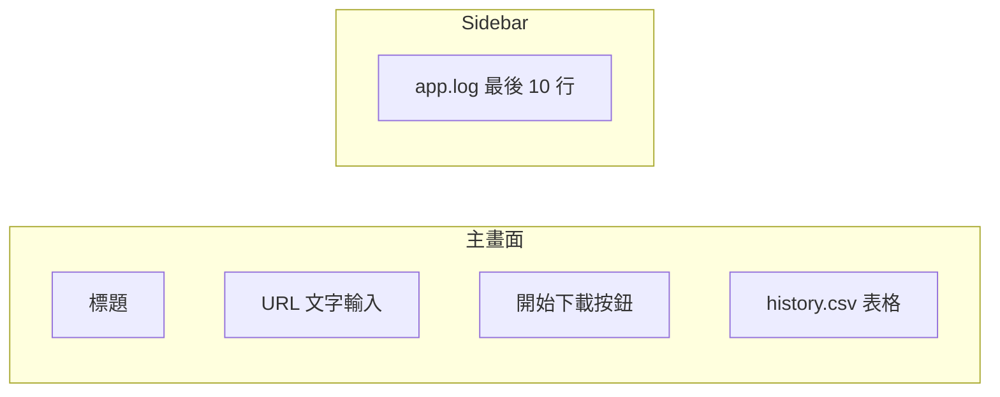

# 音樂下載與自動同步工具 — 實作計畫

## 專案結構

建立後的目錄如下：

```text
MusicDownloader/
├── requirements.txt
├── utils.py
├── app.py
├── app.log          # 執行時自動產生
├── history.csv      # 執行時自動產生
└── downloads/       # MP3 存放目錄（執行時自動建立）
```

## 系統前置需求（Windows）

`yt-dlp` 轉 MP3 需 **FFmpeg**。計畫會在 README 風格的終端說明中提醒使用者：

- 安裝方式：`winget install Gyan.FFmpeg` 或從 [ffmpeg.org](https://ffmpeg.org/download.html) 下載並加入 PATH
- 若未安裝 FFmpeg，下載會失敗並寫入 `app.log` 與紅色錯誤提示

---

## 1. [requirements.txt](requirements.txt)

列出專案直接使用的第三方套件（含版本 pin 以確保可重現）：

```text
streamlit>=1.32.0
yt-dlp>=2024.3.10
mutagen>=1.47.0
```

- `mutagen` 依你的規格列入依賴；目前規格未要求在 `utils.py` 寫入 ID3 標籤，故第一版不強制使用，但保留供後續擴充（例如寫入歌曲標題、藝人）。

---

## 2. [utils.py](utils.py) — 核心功能

### 2.1 Logging 設定

- 使用 `logging.getLogger("music_downloader")` 避免重複 handler
- `FileHandler("app.log", encoding="utf-8")`，格式範例：
  - `%(asctime)s | %(levelname)s | %(message)s`
  - 日期格式：`%Y-%m-%d %H:%M:%S`
- 設定 `handler.setLevel(logging.INFO)` 與 `logger.setLevel(logging.INFO)`
- 所有 log 訊息以**繁體中文**撰寫，例如：「開始下載」、「轉檔成功」、「下載失敗」
- 模組載入時呼叫一次 `setup_logging()`，確保 `app.py` import 後即開始寫入 `app.log`

### 2.2 `download_mp3_from_youtube(url: str) -> str`

流程：




實作要點：

- 下載目錄：`downloads/`（`pathlib.Path`，不存在則 `mkdir(parents=True)`）
- `yt_dlp.YoutubeDL` 選項：
  - `format: "bestaudio/best"`
  - `postprocessors`: `FFmpegExtractAudio`，`preferredcodec: "mp3"`，`preferredquality: "0"`（最高 VBR 品質）
  - `outtmpl`: `downloads/%(title)s.%(ext)s`
  - `quiet: True`（避免干擾 Streamlit UI）
- 先用 `extract_info(url, download=False)` 取得 `title`，再 `extract_info(url, download=True)` 執行下載
- 整段以 `try/except Exception` 包裹：
  - 開始：`logging.info(f"開始下載：{url}")`
  - 成功：`logging.info(f"轉檔成功：{title}")`
  - 失敗：`logging.error(f"下載失敗：{url} | 錯誤：{exc}")` 後 `raise`
- 回傳值：`(title: str, file_path: str)` 供 `app.py` 寫入 CSV

### 2.3 `append_to_history(title: str, url: str) -> None`

- CSV 路徑：`history.csv`（UTF-8 with BOM `utf-8-sig`，Excel 開啟中文較友善）
- 欄位：`下載時間`, `歌曲名稱`, `原始網址`
- 若檔案不存在：寫入 header + 第一筆
- 若已存在：以 append 模式追加一列
- 下載時間：`datetime.now().strftime("%Y-%m-%d %H:%M:%S")`
- 成功追加後 `logging.info(f"已寫入歷史紀錄：{title}")`

### 2.4 輔助函數（供 app.py 使用）

- `read_history() -> pd.DataFrame`：讀取 `history.csv`，不存在則回傳空 DataFrame（欄位同上）
- `read_last_log_lines(n: int = 10) -> list[str]`：讀取 `app.log` 最後 N 行；檔案不存在回傳 `["（尚無日誌）"]`

> 需在 `requirements.txt` 補上 `pandas`（Streamlit `st.dataframe` 直接吃 DataFrame；也可改用 `csv` 模組，但 pandas 與 Streamlit 整合更順）

**修正**：為減少依賴，history 讀取可用標準庫 `csv` + `st.dataframe(list_of_dicts)`，不必加 pandas。計畫採 **標準庫 csv**，requirements 維持你指定的三項。

---

## 3. [app.py](app.py) — Streamlit 介面

### 版面配置




### 實作細節


| 區塊      | 實作                                                                                           |
| ------- | -------------------------------------------------------------------------------------------- |
| 標題      | `st.set_page_config(page_title="音樂下載中心", layout="wide")` + `st.title("🎵 個人音樂自動化下載中心")`      |
| 輸入      | `st.text_input("貼上 YouTube 網址", placeholder="https://www.youtube.com/watch?v=...")`          |
| 按鈕      | `st.button("🚀 開始下載並記錄", type="primary", use_container_width=True)`                          |
| 進度      | 點擊後用 `st.spinner("正在下載並轉檔，請稍候...")` 包裹下載流程；可選加 `st.progress(0)` 在開始/結束時更新                    |
| 成功      | `st.success(f"下載成功！歌曲：{title}")`                                                             |
| 失敗      | `st.error(f"下載失敗：{error_message}")`                                                          |
| 驗證      | URL 為空時 `st.warning("請輸入 YouTube 網址")`，不呼叫下載                                                 |
| 歷史      | 頁面底部 `st.subheader("📋 下載歷史紀錄")` + `st.dataframe(read_history(), use_container_width=True)`  |
| Sidebar | `st.sidebar.header("🔧 開發者 Log")` + 讀取最後 10 行，以 `st.code("\n".join(lines))` 顯示；每次 rerun 自動刷新 |


### 互動流程

1. 使用者貼 URL → 點按鈕
2. `with st.spinner(...):` 內呼叫 `download_mp3_from_youtube(url)`
3. 成功 → `append_to_history(title, url)` → 綠色提示
4. 失敗 → 紅色提示（exception message）
5. `st.rerun()` 或在同一 run 結束後自然刷新表格與 sidebar log

---

## 4. 確認後的執行步驟（英文終端指令）

計畫確認並建立檔案後，將提供以下完整指令說明：

```powershell
# 1. Navigate to project folder
cd C:\Users\shantinghsu\Project\MusicDownloader

# 2. (Recommended) Create and activate virtual environment
python -m venv venv
.\venv\Scripts\Activate.ps1

# 3. Install dependencies
pip install -r requirements.txt

# 4. (One-time) Ensure FFmpeg is installed and on PATH
ffmpeg -version

# 5. Launch the Streamlit web app
streamlit run app.py
```

瀏覽器預設會開啟 `http://localhost:8501`。

---

## 5. 測試檢查清單

- 輸入有效 YouTube URL → MP3 出現在 `downloads/`，`history.csv` 多一列，`app.log` 有繁中 info
- 輸入無效 URL → 紅色錯誤、`app.log` 有 error
- 空 URL → 黃色 warning，不觸發下載
- Sidebar 顯示 `app.log` 最後 10 行
- 重新整理頁面後歷史表格仍正確顯示

---

## 實作範圍說明

- **只做你指定的三個檔案**，不額外建立 README（依你的 user rule）
- 執行時自動產生的 `app.log`、`history.csv`、`downloads/` 不納入 git（若日後 init repo，可加 `.gitignore`）
- 程式碼完整、不省略，符合 UC 作品集可展示標準

